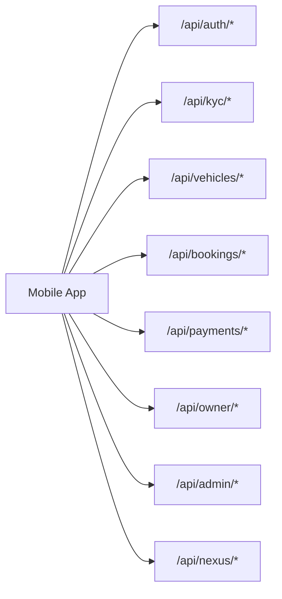

# Raidex API

## API Diagram

## Critical Endpoints

| Domain | Endpoints |
|---|---|
| Authentication | `POST /api/auth/register`, `POST /api/auth/login`, `GET /api/auth/me`, `POST /api/auth/refresh`, `POST /api/auth/logout` |
| KYC | `POST /api/kyc/submit`, `GET /api/kyc/status` |
| Vehicles | `GET /api/vehicles`, `GET /api/vehicles/{id}`, `GET /api/vehicles/{id}/availability` |
| Booking | `POST /api/bookings`, `POST /api/bookings/{id}/extend`, `POST /api/bookings/{id}/cancel`, `GET /api/bookings/{id}/invoice` |
| Payments | `POST /api/payments/create`, `POST /api/payments/{id}/confirm`, `POST /api/payments/{id}/refund` |
| Admin | `POST /api/admin/vehicles/{id}/approve`, `POST /api/admin/kyc/{id}/approve`, `PATCH /api/admin/disputes/{id}` |

## Controller Rule

Route handlers should authenticate, parse request data, call a feature service, and return the result. Business rules belong in feature services, not controllers.
