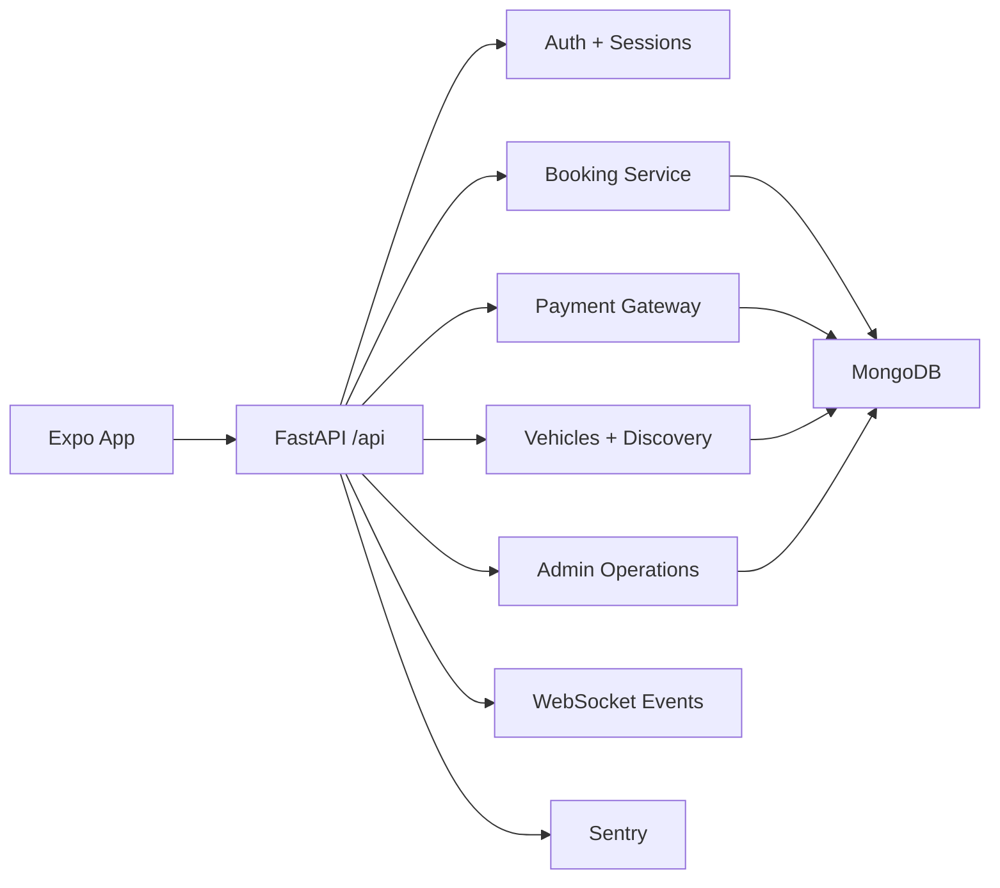
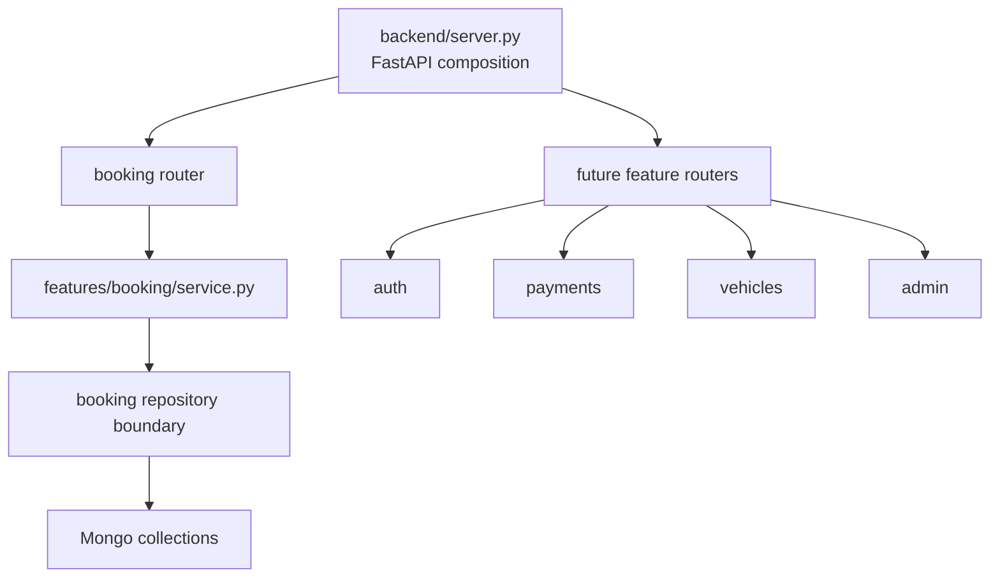
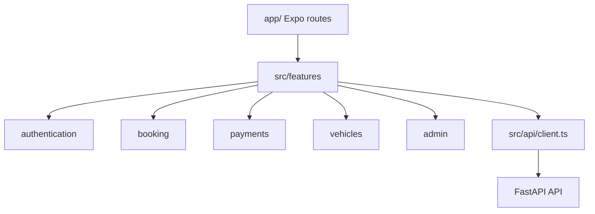
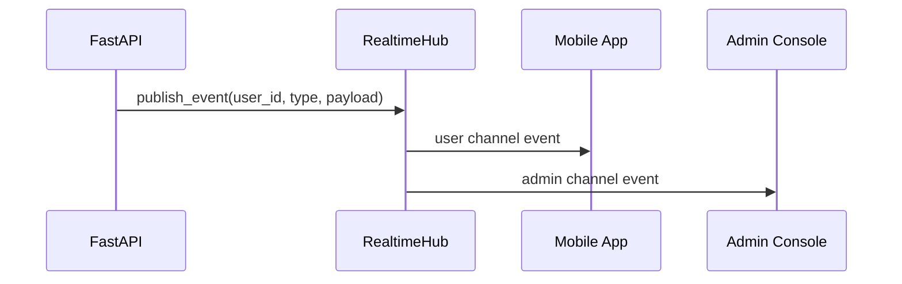
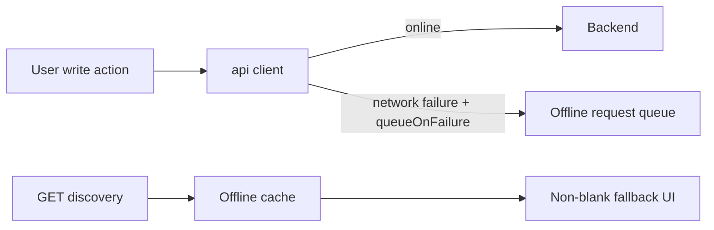

# Raidex Architecture

## Current Shape

Raidex is an Expo React Native app backed by a FastAPI service and MongoDB. The backend is being moved from a monolithic controller file toward feature services with thin HTTP route handlers.

## Backend Module Direction

The first extracted module is booking. It is independently unit-tested at service level and still exercised through the existing API routes.

## Frontend Feature Direction

Frontend route files remain in place to avoid navigation churn. New feature API/hook boundaries live under `src/features/*` and can be migrated into screens incrementally.

## Realtime Architecture

## Offline Sync Architecture

