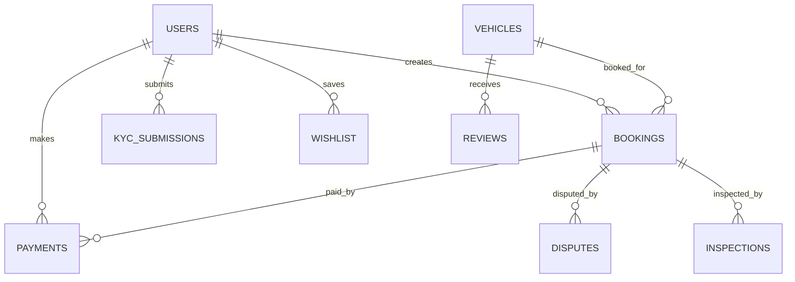
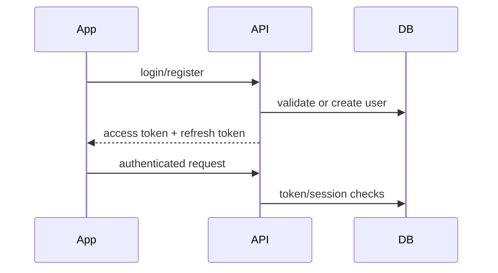
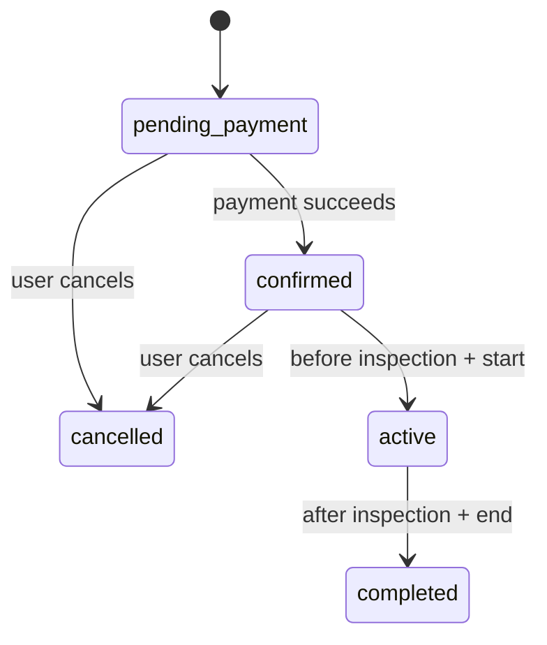
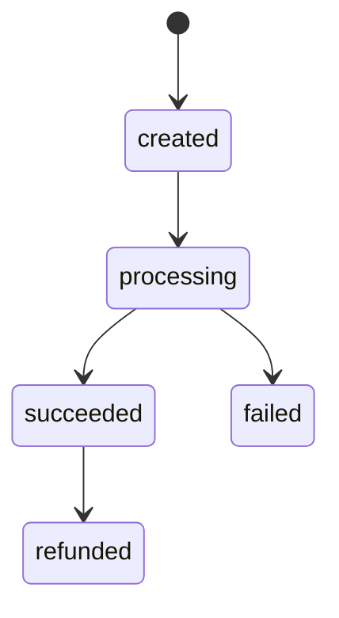
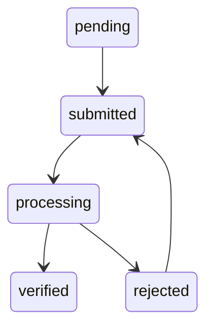

# Phase 4 Architecture Refactor Report

Date: 2026-06-25

## Mission Constraints

- No new features
- No UI work
- No visual improvements
- Preserve existing API and navigation contracts

## Before

| Area | Evidence |
|---|---|
| Backend monolith | `backend/server.py`: 2226 measured lines before extraction |
| Backend route logic | Booking create/cancel/extend/invoice/dispute business rules lived directly inside route handlers |
| Frontend organization | App route files called shared API client directly; no feature API boundaries |
| Largest frontend files | `frontend/app/(tabs)/index.tsx`: 403 lines, `frontend/app/kyc/index.tsx`: 299 lines, `frontend/app/admin/index.tsx`: 284 lines |

## After

| Area | Evidence |
|---|---|
| Booking service extracted | `backend/features/booking/service.py` |
| Thin booking controllers | Existing booking routes now delegate to `BookingService` |
| Independent backend module test | `backend/tests/test_booking_service.py` |
| Booking service coverage | 100% measured by pytest-cov |
| Frontend feature boundaries | `frontend/src/features/authentication`, `booking`, `payments`, `vehicles`, `wishlist`, `reviews`, `admin`, `maps` |
| Feature API tests | Booking, payments, vehicles, and admin feature API wrappers have independent tests |

## Verification

Backend command:

`python -m pytest backend/tests -q --cov=server --cov=features.booking --cov=providers --cov-report=term-missing`

Result:

- 35 passed
- 20 skipped legacy live localhost smoke tests
- `backend/features/booking/service.py`: 100%
- `backend/server.py`: 54%

Frontend command:

`npm.cmd test -- --watch=false`

Result:

- 10 suites passed
- 39 tests passed

Frontend typecheck:

`npm.cmd run typecheck`

Result:

- Passed

## Performance / Maintainability Measurements

| Metric | Value |
|---|---:|
| `backend/server.py` before extraction | 2226 lines |
| `backend/server.py` after booking extraction | 2069 lines; still over 500-line target |
| Largest frontend route file | `frontend/app/(tabs)/index.tsx`: 403 lines |
| Largest extracted backend feature service | `backend/features/booking/service.py`: 183 lines |
| Frontend feature API modules | 14 files under `frontend/src/features`, largest file 16 lines |

## Database ER Diagram

## Authentication Flow

## Booking Lifecycle

## Payment Lifecycle

## KYC Lifecycle

## Remaining Gaps

- `backend/server.py` is still above the approximately 500-line target.
- Only booking has been fully extracted into a tested service module in this pass.
- Payments, vehicles, admin, KYC, coupons, referrals, wishlist, reviews, notifications, analytics, and monitoring still need full backend service/repository/router extraction.
- Frontend feature modules exist as testable boundaries, but screens have not yet been moved into feature-owned `screens/` folders.
- Average module coverage is not 90% yet across all modules; only the extracted booking service reached 100%.
