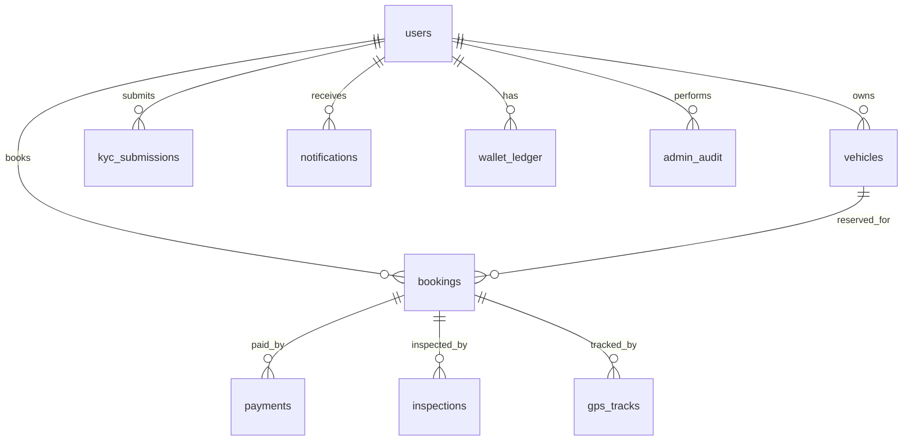

# Database Guide

## Purpose

Raidex currently uses MongoDB through the FastAPI backend. A Supabase/PostgreSQL schema also exists for structured relational deployment planning.

MongoDB connection is configured with:

```env
MONGO_URL=
DB_NAME=
```

PostgreSQL schema file:

```text
backend/supabase/migrations/001_initial_schema.sql
```

Search `RAIDEX_DATABASE_SCHEMA` to jump to the SQL schema.

## MongoDB Collections Used By Backend

- `users`
- `vehicles`
- `bookings`
- `payments`
- `kyc_submissions`
- `refresh_tokens`
- `admin_audit`
- `reviews`
- `wishlist`
- `recently_viewed`
- `coupons`
- `referrals`
- `disputes`
- `inspections`
- `gps_tracks`
- `geofence_events`
- `notifications`
- `wallet_ledger`
- `ride_miles_ledger`
- `support_threads`
- `support_messages`
- `agent_runs`
- `payouts`
- `event_log`
- `feature_flags`
- `analytics_daily`

## PostgreSQL/Supabase Tables

| Table | Purpose |
| --- | --- |
| `users` | Customers, owners, admins, wallet and KYC status |
| `user_sessions` | OAuth/session records |
| `push_tokens` | Push notification tokens |
| `vehicles` | Vehicle catalog and live location fields |
| `bookings` | Booking lifecycle |
| `payments` | Payment records and provider references |
| `kyc_submissions` | KYC document workflow |
| `inspections` | Before/after trip inspection data |
| `gps_tracks` | Route history and trip tracking |
| `geofence_events` | Geofence alerts |
| `notifications` | In-app notification history |
| `wallet_ledger` | Wallet transaction history |
| `ride_miles_ledger` | Reward points history |
| `support_threads` | Support conversation thread |
| `support_messages` | Support messages |
| `agent_runs` | AI/support/ops assistant audit |
| `admin_audit` | Admin and sensitive action audit log |
| `payouts` | Owner payout records |

## Key Relationships



## Important Indexes

- User email lookup
- Vehicle owner lookup
- Available vehicle filtering
- Booking lookup by user, owner, vehicle, and status
- Payment lookup by user, booking, status, and provider order
- KYC lookup by user
- GPS lookup by booking and vehicle
- Notifications by user
- Wallet by user
- Payouts by owner

## Backup Guidance

MongoDB:

```powershell
mongodump --uri "<MONGO_URL>" --out backups\mongodb
mongorestore --uri "<MONGO_URL>" backups\mongodb
```

PostgreSQL/Supabase:

```powershell
pg_dump "<DATABASE_URL>" > backups\raidex.sql
psql "<DATABASE_URL>" < backups\raidex.sql
```

## Migration Guidance

- Keep schema changes additive when possible.
- Add indexes before high-traffic queries rely on them.
- Backfill data in batches.
- Keep rollback SQL for destructive changes.
- Test migrations against a copied database before production.

## Data Safety Rules

- Do not store raw secrets in database rows.
- Do not store base64 media in normal database fields for production-scale usage.
- Store documents/images in object storage and save signed URLs or object keys.
- Audit all admin approvals, refunds, KYC changes, and role changes.
