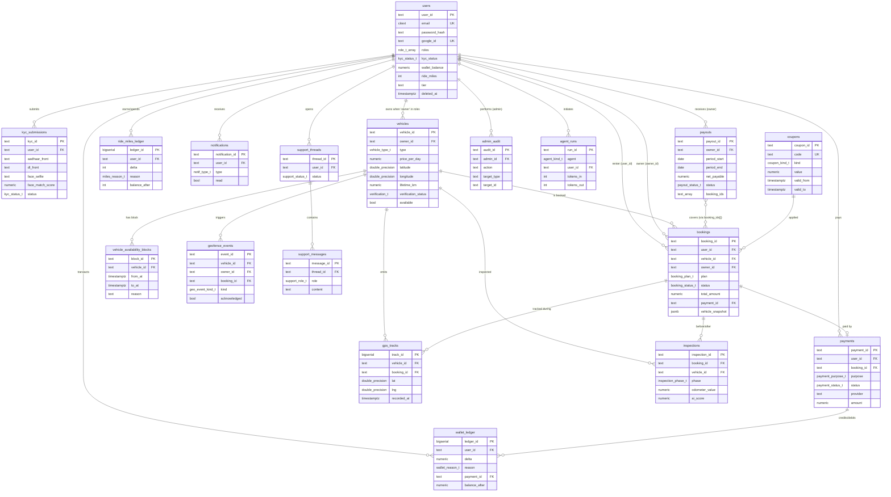

# Raidex — ER Diagram (PostgreSQL / Supabase)

> Same business entities as before, now expressed as PG tables with FK relationships and the new `vehicle_availability_blocks` child table extracted from the prior nested array. Cardinalities verified against the schema constraints.

---

## Cardinality matrix

| From | Relationship | To | Notes |
|---|---|---|---|
| `users` | 1 → 0..N | `kyc_submissions` | history preserved across retries |
| `users` (owner role) | 1 → 0..N | `vehicles` | `vehicles.owner_id` FK |
| `users` | 1 → 0..N | `bookings` (renter) | `bookings.user_id` FK |
| `users` | 1 → 0..N | `bookings` (owner) | `bookings.owner_id` FK (denormalized for owner queries) |
| `vehicles` | 1 → 0..N | `vehicle_availability_blocks` | child of nested `availability_blocks[]` from Mongo |
| `bookings` | 1 → 0..1 | `payments` | a booking has at most one primary payment (refund tracked inline) |
| `bookings` | 1 → 0..2 | `inspections` | UNIQUE(booking_id, phase) → one `before` + one `after` |
| `bookings` | 1 → 0..N | `gps_tracks` | many pings during active trip |
| `vehicles` | 1 → 0..N | `gps_tracks` | pings continue even when idle |
| `vehicles` | 1 → 0..N | `geofence_events` | independent of bookings |
| `payouts` | M → N | `bookings` | references many bookings via `booking_ids[]` array (intentionally denormalized; payout windows are immutable once paid) |
| `support_threads` | 1 → 0..N | `support_messages` | conversation history |
| `coupons` | 1 → 0..N | `bookings` | `bookings.coupon_code` text reference |

## Critical constraints encoded at DB level

1. **No double-booking** — `bookings.bk_no_overlap` GIST exclusion constraint on `vehicle_id × tstzrange(start_date, end_date)` for `status IN ('confirmed','active')`. Postgres rejects overlapping confirmed bookings atomically.
2. **One inspection per phase per booking** — `inspections.ins_unique_phase` UNIQUE.
3. **Append-only ledgers/audit/telemetry** — `REVOKE UPDATE, DELETE` from PUBLIC; only `service_role` can INSERT (via Supabase RLS + REVOKE).
4. **Score sanity** — `CHECK (ai_score BETWEEN 0 AND 1)`, `liveness_score`, `face_match_score`.
5. **Money positivity** — `payments.amount > 0`, `ride_miles >= 0`.
6. **Coherent date ranges** — `bookings.bk_date_range CHECK (end_date > start_date)`, same on availability blocks.

These are the guardrails that **cannot** be expressed cleanly in MongoDB and are the strongest argument for moving to PG when you cut over.

---

## Notes for the MVP Mongo runtime

While we continue on Mongo, the codebase will:
- Keep `vehicles.availability_blocks` as a top-level Mongo collection `vehicle_availability_blocks` (not nested) so migration is row-for-row.
- Run conflict detection in application code (read-then-write) since Mongo cannot express the GIST exclusion. We accept the small race window because typical booking traffic is sparse; will be replaced by PG's exclusion constraint at migration time.
- Use BSON UUIDs as `TEXT`-compatible strings (`usr_…`) — already in place.
- Never embed objects inside arrays we don't already have a child table for.
