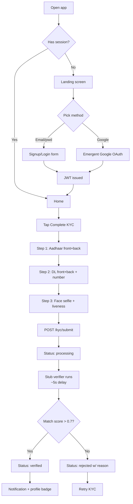
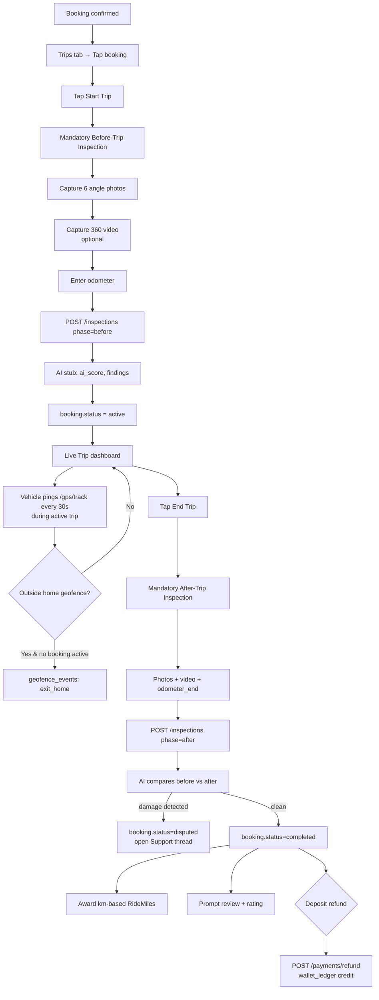
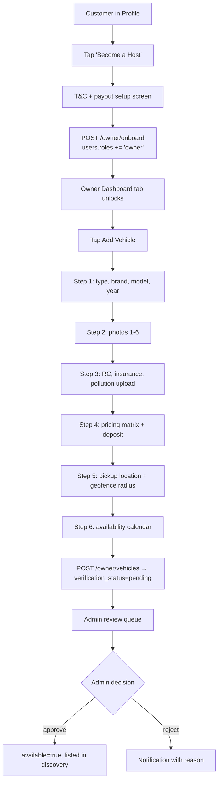
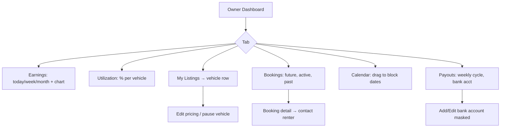
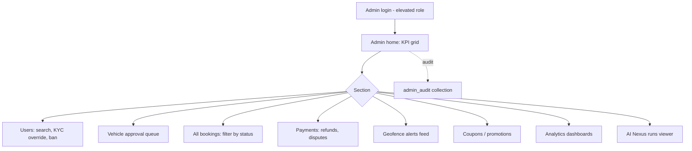
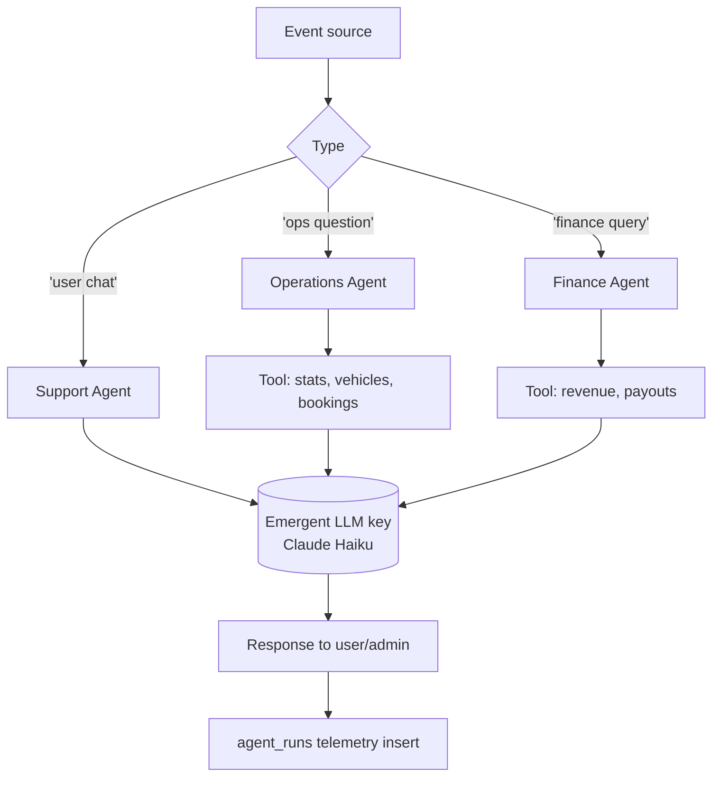
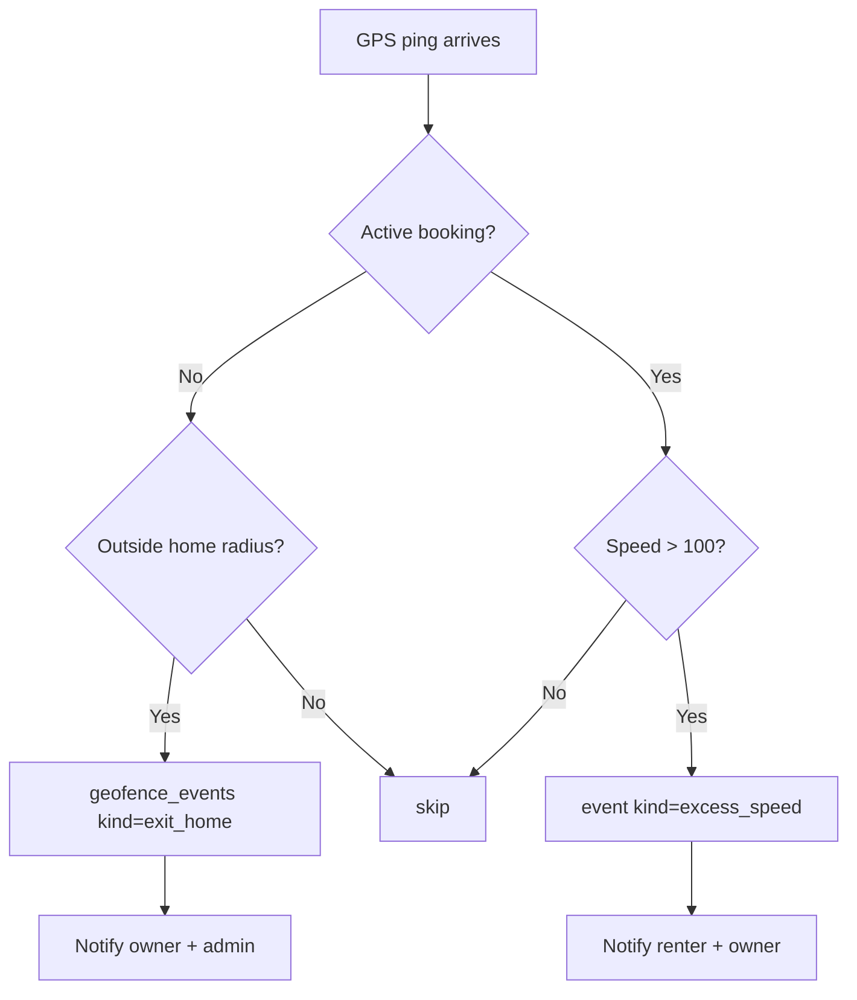

# Raidex — User Flows

> Mermaid `flowchart` notation. Each block can be rendered independently.

## Actors
- **C** — Customer (renter / subscriber)
- **O** — Vehicle Owner (host)
- **A** — Admin (Raidex ops)
- **AI** — Raidex Nexus (Support / Operations / Finance agents)

---

## F1 · Customer Onboarding & KYC



---

## F2 · Booking + Payment Lifecycle

```mermaid
flowchart TD
  D[Discovery / Vehicle Detail] --> B1[Tap Book Now]
  B1 --> KYCCHK{KYC verified?}
  KYCCHK -- No --> KYCGATE[Show KYC gate modal]
  KYCCHK -- Yes --> BF[Booking form: plan, dates, addons]
  BF --> SUM[Order Summary screen]
  SUM --> APPLY[Optional: Apply Coupon / Use RideMiles]
  APPLY --> CHK[Checkout screen]
  CHK --> CRBK[POST /bookings → status=pending_payment]
  CRBK --> CRPAY[POST /payments/create → provider=mock]
  CRPAY --> PROC[Payment Processing screen w/ spinner]
  PROC --> SIM{Stub: 95% success}
  SIM -- success --> CONF[POST /payments/{id}/confirm<br/>booking.status=confirmed]
  SIM -- failure --> FAIL[Payment Failure screen<br/>Retry CTA]
  CONF --> SUCC[Success screen: animation + booking summary]
  SUCC --> NOTIF[Push: 'Booking confirmed' + miles credit]
  FAIL --> CHK
  CONF --> LEDG[wallet_ledger + ride_miles_ledger insert]
```

---

## F3 · Trip Lifecycle (with GPS + Inspection)



---

## F4 · Vehicle Owner Onboarding & Listing



---

## F5 · Owner Daily Operations



---

## F6 · Admin Workflow



---

## F7 · AI Nexus Triggers



---

## F8 · Geofence Alert Flow (security)


