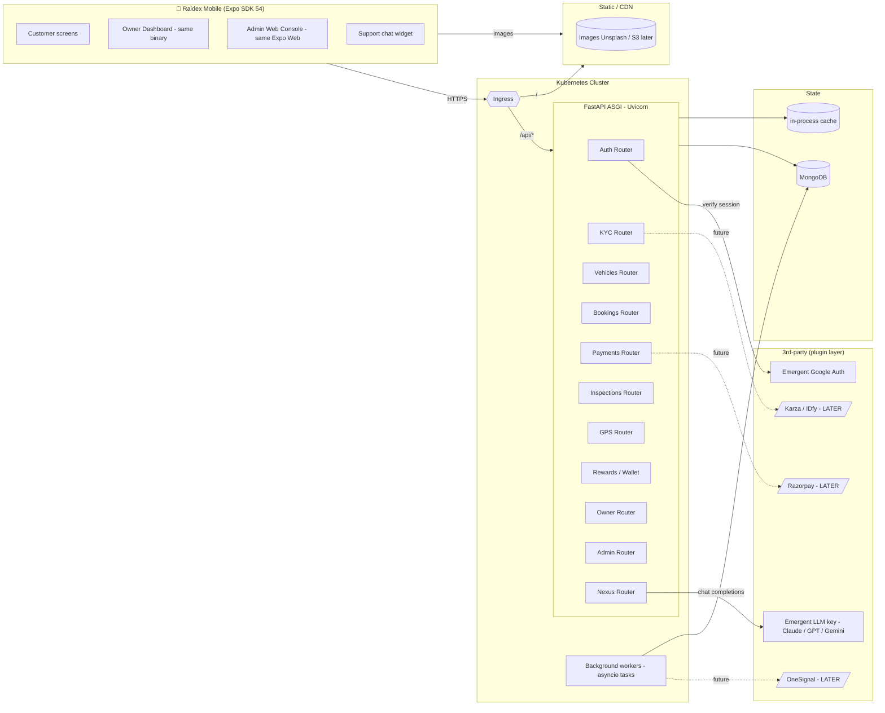

# Raidex — System Architecture



---

## Service composition (single FastAPI binary, modular)

```
backend/
├── server.py                 ← FastAPI bootstrap, middleware, mounts routers
├── core/
│   ├── auth.py               ← JWT + Emergent session resolver
│   ├── deps.py               ← Depends helpers (current_user, require_role)
│   ├── settings.py           ← env loader
│   └── db.py                 ← Motor client + indexes + seeding
├── routers/
│   ├── auth.py
│   ├── kyc.py
│   ├── vehicles.py
│   ├── bookings.py
│   ├── payments.py
│   ├── inspections.py
│   ├── gps.py
│   ├── rewards.py
│   ├── owner.py
│   ├── admin.py
│   └── nexus.py
├── services/                 ← pure business logic (no FastAPI imports)
│   ├── booking_engine.py     ← pricing, conflict detection, miles award
│   ├── payment_gateway.py    ← abstract; mock impl now, razorpay later
│   ├── kyc_provider.py       ← abstract; stub now, real providers later
│   ├── inspection_ai.py      ← stub scorer (returns deterministic score)
│   ├── geofence.py
│   └── ledger.py             ← wallet + miles double-entry
├── agents/                   ← Raidex Nexus
│   ├── base.py               ← shared LLM client + tool registry
│   ├── support_agent.py
│   ├── operations_agent.py
│   ├── finance_agent.py
│   └── tools.py              ← deterministic data tools agents can call
└── seed.py                   ← initial vehicles / admin user
```

The single binary keeps deployment trivial (one supervisor process, one container). The clean folder split is what matters for scale — every service module is import-safe and unit-testable.

## Provider abstraction (plug-in points)

| Concern | Interface (services/) | Mock impl (MVP) | Real impl (later) |
|---|---|---|---|
| Payments | `PaymentGateway.create_order / confirm / refund` | `MockGateway` (95% success, 1.5s sleep) | `RazorpayGateway` |
| KYC | `KYCProvider.submit / poll` | `StubKYCProvider` (5s delay → verified if photos present) | `KarzaProvider` / `IDFyProvider` |
| Damage AI | `DamageInspector.score(photos)` | `StubInspector` (random in [0,0.2]) | model API |
| Push notifications | `PushSender.send` | logs only | `OneSignalSender` |
| Maps tiles | client-side `react-native-maps` provider switch | OSM | Google Maps API |

Adding a real provider = drop a file in `services/`, swap env var `PAYMENT_PROVIDER=razorpay`, no router changes.

## Frontend architecture

```
frontend/app/                       ← expo-router file-based routes
├── _layout.tsx                     ← AuthProvider + AuthGate + SafeArea
├── index.tsx                       ← Landing + email/google auth
├── (tabs)/                         ← Customer tab navigator
│   ├── _layout.tsx
│   ├── index.tsx                   (Explore)
│   ├── trips.tsx
│   ├── rewards.tsx
│   └── profile.tsx
├── vehicle/[id].tsx
├── booking/[id].tsx                (Booking → Checkout)
├── checkout/[booking_id].tsx       (NEW — Order Summary)
├── pay/[payment_id].tsx            (NEW — Processing → Success/Failure)
├── trip/[booking_id].tsx           (NEW — Active trip live screen, GPS + inspection)
├── inspection/[booking_id].tsx     (NEW — Before/After capture wizard)
├── kyc/index.tsx                   (NEW — multi-step KYC wizard)
├── owner/                          (NEW — Owner Dashboard)
│   ├── _layout.tsx
│   ├── index.tsx                   (Earnings + KPIs)
│   ├── listings.tsx
│   ├── add-vehicle.tsx             (multi-step)
│   ├── bookings.tsx
│   ├── calendar.tsx
│   └── payouts.tsx
├── admin/                          (NEW — Admin Console — Expo Web primarily)
│   ├── _layout.tsx
│   ├── index.tsx                   (KPI grid)
│   ├── users.tsx
│   ├── vehicles.tsx                (approval queue)
│   ├── bookings.tsx
│   ├── payments.tsx
│   ├── geofence.tsx
│   ├── coupons.tsx
│   └── audit.tsx
└── support/                        (NEW — Raidex Nexus chat)
    └── index.tsx
```

Shared in `frontend/src/`:
- `api/client.ts` — fetch wrapper + token mgmt
- `context/AuthContext.tsx` — user, login, logout, refresh
- `theme/index.ts` — design tokens
- `components/` — Chip, VehicleCard, RatingBadge, GpsMap, etc.
- `hooks/` — `useVehicle`, `useBooking`, `useGpsStream`
- `utils/storage` — pre-shipped key/value (no AsyncStorage direct)

## Native build requirements (must document for user)

The following will not work in Expo Go / web preview and require a development build:

| Feature | Required native module |
|---|---|
| Real maps & directions | `react-native-maps` (Google Maps SDK key required) |
| Live GPS device location | `expo-location` (works in Expo Go but with limitations; background updates need dev build + `UIBackgroundModes`) |
| Camera capture for inspection / KYC | `expo-camera` (full features need dev build) |
| Push notifications | `expo-notifications` + Firebase / APNs (dev build only) |

For Expo Go preview we ship visually-faithful fallbacks:
- Map → SVG city silhouette + marker dots driven by `gps_tracks`.
- Camera → image picker fallback (Photos library).
- Push → in-app toast banners.

## Security & privacy guardrails

- All sensitive media (Aadhaar, DL, selfies) stored as base64 in MongoDB for MVP **with masking** on responses (last 4 digits only, image URLs returned only to owning user + admin with audit log).
- `/admin/*` requires `role=admin` AND records every write in `admin_audit`.
- GPS data: only owner of vehicle, active renter (during their booking), and admin can read. Background-job sweeps `gps_tracks` after 90 days (TTL index).
- Geofence + speed events generate notifications, **never** trigger remote engine actions (out of scope per user constraint).

## Scale path (out of MVP)

- Move media (photos, video, KYC docs) → S3-compatible storage; replace base64 with signed URLs.
- Extract `gps_tracks` ingestion to a worker (Celery / Cloudflare Workers) — current `/gps/track` endpoint already isolated.
- Replace single Mongo with replica + read-preference for analytics queries.
- Add ClickHouse / TimescaleDB for analytics aggregations (admin dashboards).
- AI agents: move from per-request OpenAI calls to event-driven queue + cached embeddings of FAQs.

---

# Build Order for Phase 2 (proposed)

| # | Slice | Why first |
|---|---|---|
| 1 | Rename Raidex everywhere + scaffold provider abstractions | tiny risk, unblocks all |
| 2 | KYC wizard (frontend + stub provider) + KYC gate on booking | required for realistic flow |
| 3 | Payment flow (Checkout → Order Summary → Processing → Success/Failure → Refund status) backed by MockGateway | upgrades existing booking screen, structure ready for Razorpay |
| 4 | Damage Inspection wizard + before/after enforcement on start/end trip | unlocks trip lifecycle |
| 5 | GPS tracking — simulator endpoint, live screen, geofence events | brings vehicles "alive" |
| 6 | Owner Dashboard (listings CRUD, calendar, earnings, payouts) | unlocks supply side |
| 7 | Admin Console (KPI, approval queues, users, payments, geofence feed, audit, agent runs) | gives Raidex ops control |
| 8 | AI Nexus — Support / Operations / Finance agents wired to Emergent LLM key | the wow layer |
| 9 | Integration test pass | green light to ship |

Each numbered slice is independently testable (testing_agent run between slices for ones that touch business logic).
